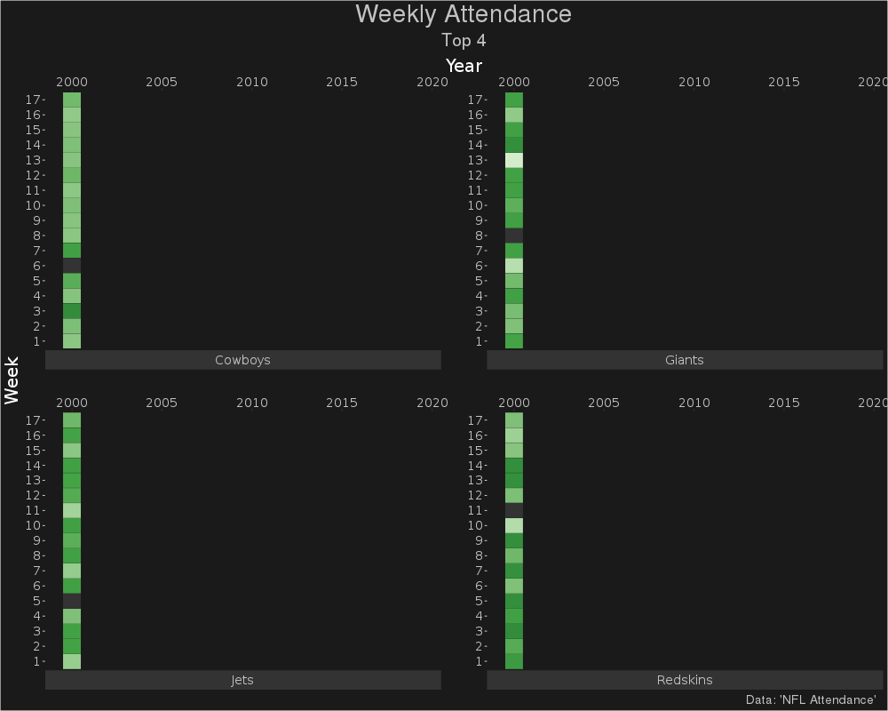

```{css, echo=FALSE}
pre code {
white-space: pre !important;
overflow-x: scroll !important;
word-break: keep-all !important;
word-wrap: initial !important;
}
```

```{r style, echo = FALSE, results = 'asis'}
BiocStyle::markdown()
options(width=60, max.print=1000)
knitr::opts_chunk$set(
    eval=as.logical(Sys.getenv("KNITR_EVAL", "TRUE")),
    cache=as.logical(Sys.getenv("KNITR_CACHE", "TRUE")), 
    tidy.opts=list(width.cutoff=60), tidy=TRUE)
```

```{r setup, echo=FALSE, messages=FALSE, warnings=FALSE, eval=TRUE}
# pkg <- c("devtools", "tidytuesdayR", "tidyverse", "paletteer", "grDevices", "gganimate", "dplyr", "gifski", "extrafont")
# for(i in seq_along(pkg)){
#   if(!requireNamespace(pkg[i], quietly=TRUE))
#     install.packages(pkg[i])
# }
suppressPackageStartupMessages({
  library(tidyverse)
  library(paletteer)
  library(grDevices)
  library(gganimate)
  library(magrittr)
  library(dplyr) 
  library(gifski)
  library(extrafont)
})
```

# 2020-02 - NFL Attendance

## DataSet

### Download the data: Option 1

```{r, downloadData, eval=TRUE}
attendance <- readr::read_csv('https://raw.githubusercontent.com/rfordatascience/tidytuesday/master/data/2020/2020-02-04/attendance.csv')
standings <- readr::read_csv('https://raw.githubusercontent.com/rfordatascience/tidytuesday/master/data/2020/2020-02-04/standings.csv')
games <- readr::read_csv('https://raw.githubusercontent.com/rfordatascience/tidytuesday/master/data/2020/2020-02-04/games.csv')
```

### Get the data through the package: Option 2

```{r, downloadData2, eval=FALSE}
# Install pkg by devtools
devtools::install_github("thebioengineer/tidytuesdayR")

## Load the data
tuesdata <- tidytuesdayR::tt_load('2020-02-04') 
## OR
tuesdata <- tidytuesdayR::tt_load(2020, week = 6)

## Get the individual tables
attendance <- tuesdata$attendance
```

### Getting data locally: Option 3

Check out path and change if necessary

```{r}
getwd()
#setwd("./TidyTuesday/")
dir()
```

Load Data:

```{r, loadData, eval=FALSE}
attendance <- read.csv(file = "../data/2020/2020-02-04/attendance.csv")
standings <- read.csv(file = "../data/2020/2020-02-04/standings.csv")
games <- read.csv(file = "../data/2020/2020-02-04/games.csv")
```

## Looking the data

```{r, eval=TRUE}
attendance
dim(attendance)
colnames(attendance)
unique(attendance$team)
summary(attendance$team)
unique(attendance$year)
summary(attendance$year)
any(is.na(attendance$weekly_attendance))
str(attendance)
```

## Combine tables
```{r}
combine <- attendance %>% left_join(standings, by = c("team", "team_name", "year"))
```

## Add a column 
```{r}
combine <- combine %>% mutate(full_name = paste(team, team_name, sep = "_"))
```

## Removing a column and row
```{r}
col_remove <- names(combine) %in% c("full_name")
combine[,!col_remove]

row_remove <- combine$team %in% "Arizona"
combine[!row_remove,]
```

## Filter the data

```{r}
combine <- combine %>% group_by(full_name, year) %>% mutate(avg_home_att = round(mean(home / 8), 0)) %>% ungroup()

att_home <- combine %>% select(full_name, year, avg_home_att, playoffs) %>% distinct() 

att_home_summary <- att_home %>% group_by(full_name, playoffs) %>% mutate(avg_home_att_poff = round(mean(avg_home_att), 0)) %>% ungroup() %>% select(full_name, playoffs, avg_home_att_poff) %>% distinct() 
```


## 2019 NFL pts_win and pts_loss Comparison (Home team
```{r}
library(RColorBrewer)
n <- length(unique(games$home_team))
qual_col_pals <-  brewer.pal.info[brewer.pal.info$category == 'qual',]
nflcol <-  unlist(mapply(brewer.pal, qual_col_pals$maxcolors, rownames(qual_col_pals)))
#pie(rep(1,n), col=sample(nflcol, n))

plotdat <- games %>% filter(year == 2019) %>%
  group_by(home_team_name) %>%
  summarise(pts_win = mean(pts_win, na.rm = TRUE), pts_loss = mean(pts_loss, na.rm = TRUE)) %>%
  arrange(pts_win) %>%
  mutate(home_team_name = factor(home_team_name, levels = .$home_team_name))

ggplot(plotdat, aes(x = pts_win, y = pts_loss, col = home_team_name, label = home_team_name)) + geom_text(size =3) +   scale_color_manual(values = nflcol) +
  guides(col = FALSE) + theme_light() +
  labs(x = "Mean pts_win", y = "Mean pts_loss", title = "2019 NFL pts_win and pts_loss Comparison (Home team)")
```


Code based on [link](https://duvancho321.github.io/Tidyuesday/Folder/2020/2020-02-04/)

```{r, gganimate}
top <- attendance %>% 
  filter(!is.na(weekly_attendance)) %>% 
  group_by(team_name) %>% 
  summarise(n = sum(weekly_attendance)) %>% 
  top_n(4)

df <- attendance %>% 
  #filter(!is.na(weekly_attendance)) %>% 
  filter(team_name %in% top$team_name)

g <-   ggplot(df,aes(x=year,y = as.factor(week))) +
  scale_x_continuous(position = "top")+
  scale_fill_paletteer_c("grDevices::Greens",direction = -1)+
  geom_tile(data = subset(df, !is.na(weekly_attendance)), aes(fill = weekly_attendance),  color="grey12")+
  geom_tile(data = subset(df, is.na(weekly_attendance)), fill="grey20", color="grey12")+
  facet_wrap(~team_name,nrow = 2,strip.position = "bottom",scales = "free")+
  labs(title = "Weekly Attendance",
       subtitle = "Top 4",
       x = "Year",
       y = "Week",
       fill = "Rate",
       caption = "Data: 'NFL Attendance'")+
  theme(panel.grid = element_blank(),
        axis.ticks.y = element_line(color = "grey76"),
        legend.position = "none",
        legend.background = element_rect(fill = "grey10"),
        legend.key.size = unit(1.5,"cm"),
        panel.background = element_rect(fill="grey10",color = "grey10"),
        plot.background = element_rect(fill="grey10"),
        strip.background = element_rect(fil="grey20"),
        panel.spacing = unit(2, "lines"),
        plot.title = element_text(size=28, color="grey76",hjust = .5),
        plot.subtitle  = element_text(size=20, color="grey76", hjust = .5),
        plot.caption = element_text(size = 14,color = "grey76", hjust = .99),
        axis.text = element_text(family = "Roboto Mono",
                                 size = 14,
                                 colour = "grey76"), 
        strip.text.x =element_text(family = "Roboto Mono",
                                   size = 14,
                                   colour = "grey76"), 
        axis.title =  element_text(family = "Roboto Mono",
                                   size = 20,
                                   colour = "white"),
        legend.text = element_text(family = "Roboto Mono",
                                   size = 10,
                                   colour = "grey76"),
        legend.title = element_text(family = "Roboto Mono",
                                   size = 14,
                                   colour = "grey76")) 
g
```
```{r, eval=FALSE}
g1 <- g + transition_time(year)+
  shadow_mark() + enter_recolor()
animate(g1, renderer = gifski_renderer(), height = 800, width = 1000, fps = 10)
anim_save("g1_plot.gif")
```



# Version Information

```{r sessionInfo}
sessionInfo()
```

# References
