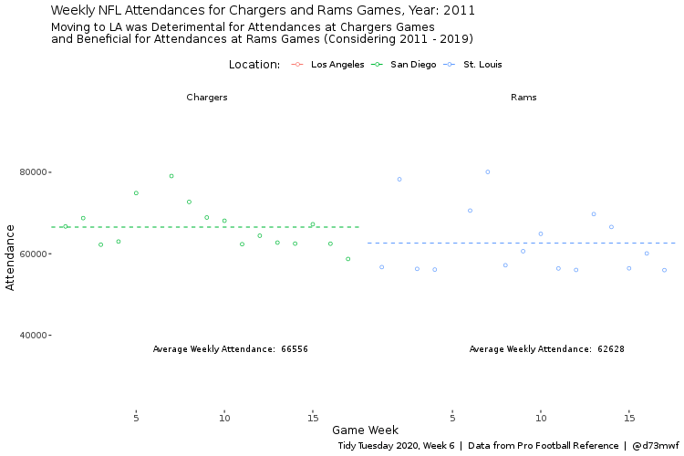

```{css, echo=FALSE}
pre code {
white-space: pre !important;
overflow-x: scroll !important;
word-break: keep-all !important;
word-wrap: initial !important;
}
```

```{r style, echo = FALSE, results = 'asis'}
BiocStyle::markdown()
options(width=60, max.print=1000)
knitr::opts_chunk$set(
    eval=as.logical(Sys.getenv("KNITR_EVAL", "TRUE")),
    cache=as.logical(Sys.getenv("KNITR_CACHE", "TRUE")), 
    tidy.opts=list(width.cutoff=60), tidy=TRUE)
```

```{r setup, echo=FALSE, messages=FALSE, warnings=FALSE, eval=TRUE}
# pkg <- c("devtools", "tidytuesdayR", "tidyverse", "paletteer", "grDevices", "gganimate", "dplyr", "gifski", "extrafont")
# for(i in seq_along(pkg)){
#   if(!requireNamespace(pkg[i], quietly=TRUE))
#     install.packages(pkg[i])
# }
suppressPackageStartupMessages({
  library(tidyverse)
  library(paletteer)
  library(grDevices)
  library(gganimate)
  library(magrittr)
  library(dplyr) 
  library(gifski)
  library(extrafont)
  library(ggrepel)
})
```

# 2020-02 - NFL Attendance

## DataSet

### Download the data: Option 1

```{r, downloadData, eval=TRUE}
attendance <- readr::read_csv('https://raw.githubusercontent.com/rfordatascience/tidytuesday/master/data/2020/2020-02-04/attendance.csv')
standings <- readr::read_csv('https://raw.githubusercontent.com/rfordatascience/tidytuesday/master/data/2020/2020-02-04/standings.csv')
games <- readr::read_csv('https://raw.githubusercontent.com/rfordatascience/tidytuesday/master/data/2020/2020-02-04/games.csv')
```

### Get the data through the package: Option 2

```{r, downloadData2, eval=FALSE}
# Install pkg by devtools
devtools::install_github("thebioengineer/tidytuesdayR")

## Load the data
tuesdata <- tidytuesdayR::tt_load('2020-02-04') 
## OR
tuesdata <- tidytuesdayR::tt_load(2020, week = 6)

## Get the individual tables
attendance <- tuesdata$attendance
```

### Getting data locally: Option 3

Check out path and change if necessary

```{r}
getwd()
#setwd("./TidyTuesday/")
dir()
```

Load Data:

```{r, loadData, eval=FALSE}
attendance <- read.csv(file = "../data/2020/2020-02-04/attendance.csv")
standings <- read.csv(file = "../data/2020/2020-02-04/standings.csv")
games <- read.csv(file = "../data/2020/2020-02-04/games.csv")
```

## Looking the data

```{r, eval=TRUE}
attendance
dim(attendance)
colnames(attendance)
unique(attendance$team)
summary(attendance$team)
unique(attendance$year)
summary(attendance$year)
any(is.na(attendance$weekly_attendance))
str(attendance)
```

### Combine tables
```{r}
combine <- attendance %>% left_join(standings, by = c("team", "team_name", "year"))
```

### Add a column 
```{r}
combine <- combine %>% mutate(full_name = paste(team, team_name, sep = "_"))
```

### Removing a column and row
```{r}
col_remove <- names(combine) %in% c("full_name")
combine[,!col_remove]

row_remove <- combine$team %in% "Arizona"
combine[!row_remove,]
```

## Filter the data

```{r}
combine <- combine %>% group_by(full_name, year) %>% mutate(avg_home_att = round(mean(home / 8), 0)) %>% ungroup()

att_home <- combine %>% select(full_name, year, avg_home_att, playoffs) %>% distinct() 

att_home_summary <- att_home %>% group_by(full_name, playoffs) %>% mutate(avg_home_att_poff = round(mean(avg_home_att), 0)) %>% ungroup() %>% select(full_name, playoffs, avg_home_att_poff) %>% distinct() 

# add average annual home attendances
att_home_summary <- att_home_summary %>% pivot_wider(names_from = playoffs, values_from = avg_home_att_poff) 
att_home_summary <- att_home_summary %>% mutate(playoff_boost = Playoffs - `No Playoffs`)
att_home_summary <- att_home_summary %>% mutate(playoff_boost_grp = ifelse(playoff_boost > 0, "Positive", "Negative"))
```


## 2019 NFL pts_win and pts_loss Comparison (Home team
```{r}
library(RColorBrewer)
n <- length(unique(games$home_team))
qual_col_pals <-  brewer.pal.info[brewer.pal.info$category == 'qual',]
nflcol <-  unlist(mapply(brewer.pal, qual_col_pals$maxcolors, rownames(qual_col_pals)))
#pie(rep(1,n), col=sample(nflcol, n))

plotdat <- games %>% filter(year == 2019) %>%
  group_by(home_team_name) %>%
  summarise(pts_win = mean(pts_win, na.rm = TRUE), pts_loss = mean(pts_loss, na.rm = TRUE)) %>%
  arrange(pts_win) %>%
  mutate(home_team_name = factor(home_team_name, levels = .$home_team_name))

ggplot(plotdat, aes(x = pts_win, y = pts_loss, col = home_team_name, label = home_team_name)) + geom_text(size =3) +   scale_color_manual(values = nflcol) +
  guides(col = FALSE) + theme_light() +
  labs(x = "Mean pts_win", y = "Mean pts_loss", title = "2019 NFL pts_win and pts_loss Comparison (Home team)")
```

## Plot Attendence

[Code by](https://github.com/JulianCollins/TidyTuesday/blob/master/tt_2020/tt_2020_w6_NFLattendaces/tt_2020_w6_NFLattendances.R)

```{r}
att_home_summary %>% 
  ggplot(aes(x = fct_reorder(full_name, playoff_boost), y = playoff_boost, fill = playoff_boost_grp)) +
  geom_col() +
  coord_flip() +
  scale_y_continuous(limits = c(-10100, 10100)) +
  scale_fill_manual(values = c('#C9000C', '#042455')) +
  annotate(geom = "curve", x = 4, y = -7500, xend = 2, yend = -9500, curvature = 0.25, arrow = arrow(length = unit(2.5, "mm"))) +
  annotate(geom = "text", x = 4, y = -5500, label = "relocated: 2016", fontface = "bold", family = "Rockwell", size = 3.5) +
  theme_linedraw() +
  theme(panel.border = element_blank()) +
  theme(legend.position = "none") +
  theme(panel.background = element_rect(fill = '#EAEAEA')) +
  theme(panel.grid = element_line(colour = "white", size = 5, linetype = "longdash")) +
  labs(title = "Fairweather Fans?", subtitle = "impact of reaching NFL playoffs upon average home attendance", x = "", y = "Playoff boost: 000s of additional spectators per match (average) during playoff seasons") +
  theme(plot.title = element_text(size = 24, face = "bold", family = "Rockwell")) +
  theme(plot.subtitle = element_text(size = 16, face = "bold", family = "Rockwell")) +
  theme(axis.title = element_text(face = "bold", family = "Rockwell")) +
  theme(axis.text = element_text(family = "Rockwell", margin = margin(0,0,50,0)))
```

Save the plot

```{r, eval=FALSE}
ggsave("tt2020_w6_NFLattendances.png", width = 25, height = 20, units = "cm", dpi = 300)
```

## Animation Plot

Code based on [link](https://duvancho321.github.io/Tidyuesday/Folder/2020/2020-02-04/)

```{r, gganimate}
top <- attendance %>% 
  filter(!is.na(weekly_attendance)) %>% 
  group_by(team_name) %>% 
  summarise(n = sum(weekly_attendance)) %>% 
  top_n(4)

df <- attendance %>% 
  #filter(!is.na(weekly_attendance)) %>% 
  filter(team_name %in% top$team_name)

g <-   ggplot(df,aes(x=year,y = as.factor(week))) +
  scale_x_continuous(position = "top")+
  scale_fill_paletteer_c("grDevices::Greens",direction = -1)+
  geom_tile(data = subset(df, !is.na(weekly_attendance)), aes(fill = weekly_attendance),  color="grey12")+
  geom_tile(data = subset(df, is.na(weekly_attendance)), fill="grey20", color="grey12")+
  facet_wrap(~team_name,nrow = 2,strip.position = "bottom",scales = "free")+
  labs(title = "Weekly Attendance",
       subtitle = "Top 4",
       x = "Year",
       y = "Week",
       fill = "Rate",
       caption = "Data: 'NFL Attendance'")+
  theme(panel.grid = element_blank(),
        axis.ticks.y = element_line(color = "grey76"),
        legend.position = "none",
        legend.background = element_rect(fill = "grey10"),
        legend.key.size = unit(1.5,"cm"),
        panel.background = element_rect(fill="grey10",color = "grey10"),
        plot.background = element_rect(fill="grey10"),
        strip.background = element_rect(fil="grey20"),
        panel.spacing = unit(2, "lines"),
        plot.title = element_text(size=28, color="grey76",hjust = .5),
        plot.subtitle  = element_text(size=20, color="grey76", hjust = .5),
        plot.caption = element_text(size = 14,color = "grey76", hjust = .99),
        axis.text = element_text(family = "Roboto Mono",
                                 size = 14,
                                 colour = "grey76"), 
        strip.text.x =element_text(family = "Roboto Mono",
                                   size = 14,
                                   colour = "grey76"), 
        axis.title =  element_text(family = "Roboto Mono",
                                   size = 20,
                                   colour = "white"),
        legend.text = element_text(family = "Roboto Mono",
                                   size = 10,
                                   colour = "grey76"),
        legend.title = element_text(family = "Roboto Mono",
                                   size = 14,
                                   colour = "grey76")) 
g
```

## Animation :)
```{r, eval=FALSE}
g1 <- g + transition_time(year)+
  shadow_mark() + enter_recolor()
animate(g1, renderer = gifski_renderer(), height = 800, width = 1000, fps = 10)
anim_save("g1_plot.gif")
```


Code based on [link](https://raw.githubusercontent.com/DomDF/TidyTuesdays/master/week6.R)


```{r, animation, eval=TRUE}

plot_data <- combine %>% 
  filter(grepl(pattern = 'Chargers|Rams', x = team_name)) %>% 
  filter(year > 2010)

avg_att <- plot_data %>% 
  group_by(team, team_name, year) %>% 
  summarise(avg_weekly_atd =  round(x = mean(x = weekly_attendance, na.rm = TRUE), digits = 0)) %>% 
  ungroup()

att_th <- 9e4
top_att <- plot_data %>% 
  filter(weekly_attendance > att_th) %>% 
  select(weekly_attendance)

top_att_games <- data.frame(team = character(), team_name = character(), year = double(), week = double(), weekly_attendance = double())
for (i in seq(from = 1, to = nrow(top_att), by = 1)){
  top_att_games <- rbind(top_att_games, data.frame(combine %>% 
                                                     filter(weekly_attendance == top_att$weekly_attendance[i]) %>% 
                                                     select(team, team_name, year, week, weekly_attendance) %>% 
                                                     arrange(desc(weekly_attendance)) %>% 
                                                     mutate(opp_team = case_when(weekly_attendance == lag(x = weekly_attendance, n = 1) ~ lag(x = team, n = 1),
                                                                                 weekly_attendance == lead(x = weekly_attendance, n = 1) ~ lead(x = team, n = 1))) %>% 
                                                     mutate(opp_team_name = case_when(weekly_attendance == lag(x = weekly_attendance, n = 1) ~ lag(x = team_name, n = 1),
                                                                                      weekly_attendance == lead(x = weekly_attendance, n = 1) ~ lead(x = team_name, n = 1))) %>% 
                                                     filter(grepl(pattern = 'Chargers|Rams', x = team_name))))
}
```

Generate the Plot

```{r, plot_anim, eval=FALSE}
plot <- ggplot(data = plot_data)+
  geom_point(mapping = aes(x = week, y = weekly_attendance, col = team), shape = 1)+
  geom_hline(mapping = aes(yintercept = avg_weekly_atd, col = team), linetype = 2, data = avg_att)+
  geom_text_repel(mapping = aes(x = 10, y = 3.5e4, label = paste('Average Weekly Attendance: ', avg_weekly_atd)), 
                  family = 'Bahnschrift', size = 3, data = avg_att, seed = 1008, segment.alpha = 0.4)+
  geom_text_repel(mapping = aes(x = week, y = weekly_attendance, label = paste('vs: ', opp_team_name)), 
                  family = 'Bahnschrift', size = 2.75, data = top_att_games, seed = 1008, segment.alpha = 0.4)+
  facet_wrap(facets = ~ team_name)+
  ggthemes::theme_tufte(base_size = 12, base_family = 'Bahnschrift')+
  labs(x = 'Game Week', y = 'Attendance', col = 'Location: ', 
       title = "Weekly NFL Attendances for Chargers and Rams Games, Year: {closest_state}",
       subtitle = 'Moving to LA was Deterimental for Attendances at Chargers Games \n and Beneficial for Attendances at Rams Games (Considering 2011 - 2019)',
       caption = 'Tidy Tuesday 2020, Week 6  |  Data from Pro Football Reference  |  @d73mwf')+
  theme(legend.position = 'top')+
  transition_states(states = year, transition_length = 1, state_length = 5, wrap = FALSE)+
  enter_fade() + exit_fade()

animate(plot = plot, fps = 20, duration = 10, end_pause = 3, width = 750, height = 500)

anim_save(animation = last_animation(), filename = 'g2_plot.gif')
```



# Version Information

```{r sessionInfo}
sessionInfo()
```

# References
